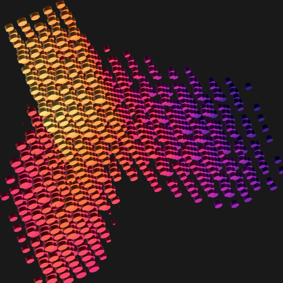

<p align="center">
  
</p>

# Frost

**A model router built on [TypeSafe](https://typesafe.ai/).** A [Haplab](https://haplab.com) project.

Give Frost a prompt, anything from a one-line request to a full markdown doc and it recommends a model, a harness or API, and an effort level where supported. It also gives an explanation and alternatives, in readable text or JSON for your agents and scripts.

Frost uses TypeSafe's Jev to assess the task, then makes the routing decision locally in Go. One analysis request on the normal path; deterministic selection after that. It recommends what to run without launching the model.

- **Spend according to the task.** The default policy chooses the cheapest configured profile that meets the quality floor. Prefer quality or speed when the task calls for it.
- **Bring your own models.** Configure the models, harnesses, APIs, and effort settings you can actually use. Refresh model data from online sources or supply your own catalog.
- **Use your subscriptions.** Optional [CodexBar integration](examples/capacity/README.md) lets recommendations account for Claude, Codex, and other subscription limits you've connected.
- **Inspect every decision.** Structured results expose the analysis, constraints, evidence, and uncertainty. Record a decision and replay it offline against a different policy.

## Quick start

Install on macOS or Linux with Homebrew:

```sh
brew install marcus/tap/frost
```

Both `frost` and `catalog-build` are included. Copy the starter configuration:

```sh
frost_assets="$(brew --prefix frost)/share/frost"
mkdir -p ~/.config/frost
cp "$frost_assets/config/frost.example.toml" ~/.config/frost/config.toml
cp "$frost_assets/config/catalog.example.json" "$frost_assets/config/questions-v3.json" ~/.config/frost/
```

Set `TYPESAFE_API_KEY` in your environment with your [TypeSafe](https://typesafe.ai/) API key. Edit `~/.config/frost/config.toml` to match your model access, then check it and route a task:

```sh
frost config check
frost route "Find why our retries sometimes duplicate a payment."
frost route --file task.md --json
```

The starter profiles and rankings are examples, not a promise that every listed model is available to your account. See the [configuration guide](config/README.md) for profiles, catalogs, effort mappings, and capacity settings. A missing optional capacity snapshot is reported but doesn't block routing.

Prebuilt macOS and Linux archives are also available on the [releases page](https://github.com/marcus/frost/releases). They include both executables and the configuration assets. To build from source, see [Development](#development).

## Choose a policy

```sh
# Default: choose the cheapest adequate profile.
frost route "Fix the typo in the navigation label."

# Prefer quality or speed among adequate candidates.
frost route --policy quality "Prove this lock-free queue is linearizable."
frost route --policy fast "Summarize this incident report."

# Restrict the candidate profiles or request an effort level.
frost route --allow sol,astra --effort high --file task.md

# Read from a pipeline or a structured request.
frost route --stdin --json < task.md
frost route --request request.json --json

frost profiles list --json
frost route --help
```

Policies are `adequate`, `quality`, `fast`, and `relaxed`. The last explicitly lowers the quality floor. Flags override the request object, which overrides configuration. Frost resolves configuration from `--config`, then `FROST_CONFIG`, then `~/.config/frost/config.toml`.

JSON mode writes one result or error object to stdout and diagnostics to stderr. Exit codes are `0` for a recommendation or provisional result, `2` for input/configuration errors, `3` for missing context, no match, or conflicting constraints, and `4` for analyzer failures.

## Speed and cost

Routing adds one small TypeSafe analysis request on the normal path, followed by local selection; transient failures can trigger retries. The [recorded pilot](docs/research/router-pilot.md) measured mean analysis times of 104–145 ms across three small runs, including HTTP, decoding, and validation. Those measurements exclude process startup and record-file synchronization and are not an end-to-end latency guarantee.

TypeSafe [lists Jev at $0.042 per million input tokens, with free output](https://typesafe.ai/blog/introducing-system-one-models-and-jev). At that price, a 2,000-input-token analysis costs about $0.000084. This is a list-price estimate for analysis only, not measured account billing or the cost of running the recommended model.

## Refresh model data—or bring your own

The separate `catalog-build` command refreshes model facts and prices from models.dev, plus SWE-bench Verified measurements where reviewed model mappings exist. Catalog updates happen when you run the producer; routing reads the local catalog without fetching those sources again.

```sh
catalog-build refresh \
  --overlay "$(brew --prefix frost)/share/frost/tools/catalog-build/overlay.json" \
  --out ~/.config/frost/catalog.json
catalog-build validate ~/.config/frost/catalog.json
```

Set `catalog_file = "catalog.json"` in your configuration to use the result. Refreshes show a diff, publish atomically, and retain the previous catalog. You can instead point `catalog_file` at your own compatible JSON catalog, or keep durable local changes in `catalog.overrides.json`.

Optional Artificial Analysis enrichment uses `ARTIFICIAL_ANALYSIS_API_KEY` and `--restricted-out` to write a separate local catalog. Imported data has its own terms; see [source notices](tools/catalog-build/NOTICES.md) and the [catalog guide](config/README.md#produced-catalogs) before redistributing it. From a source checkout, use `--overlay tools/catalog-build/overlay.json`.

## Respect subscription limits

Frost reads a neutral capacity snapshot. Install CodexBar and `jq` and ensure both are on `PATH` to use the optional integration. The CodexBar wrapper collects usage and writes that file independently:

```sh
frost_assets="$(brew --prefix frost)/share/frost"
cp "$frost_assets/examples/capacity/bindings.json" ~/.config/frost/capacity-bindings.json
# Edit bindings to match your accounts and configured pools, then refresh.
"$frost_assets/examples/capacity/refresh.sh" \
  --bindings ~/.config/frost/capacity-bindings.json \
  --out ~/.config/frost/capacity.json
frost capacity check ~/.config/frost/capacity.json
frost route --availability exclude "Review this migration for correctness."
```

Choose `exclude` to skip exhausted pools, `demote` to put them behind peers within the same objective tier, or `ignore` to bypass capacity for a call. Capacity only affects profiles that already meet the quality floor. Missing, stale, failed, or unverified observations remain unknown. Any producer that emits the snapshot format can replace CodexBar; see the [integration guide](examples/capacity/README.md) for requirements and optional scheduled refreshes.

## Record and replay

```sh
frost route --record .local/run.jsonl "Investigate the intermittent deadlock."
frost route --replay .local/run.jsonl --policy quality --json
frost explain saved-decision.json
```

Replay recomputes decisions with the current configuration without a provider call. Records include the task text, answers, and decision; keep them local unless you've reviewed them for sharing. A changed question specification requires fresh analysis. Live routing sends the supplied task to TypeSafe.

## How it works

Frost is written in **Go**, with **TypeSafe Jev** behind a replaceable task-analyzer interface, **TOML** configuration, **JSON** catalogs and capacity snapshots, and **JSONL** recordings. It needs no database or background service.

The CLI calls a deterministic routing core that applies constraints, checks adequacy, and compares eligible profiles according to your policy. External analysis, catalog collection, and usage collection have separate adapters. Model evidence describes what's known about a model; profiles describe what you can run; capacity describes what's available now.

Recommendations currently remain **provisional**. The bundled catalog has no applicable task-family measurements for the configured models, latency classes are priors, and paired task-completion outcomes have not yet been collected. Frost exposes these limits in its results rather than treating configured rankings as measured performance. The [pilot findings](docs/research/router-pilot.md) describe the available evidence.

## Development

Requires Go 1.27 or later.

```sh
git clone https://github.com/marcus/frost.git
cd frost
make build       # bin/frost and bin/catalog-build
make install     # install both to ~/.local/bin
make check       # formatting, build, race tests, vet, and lint
```

For source installs, copy the starter files from `config/` using the same layout as the quick start. `make install` installs executables; configuration and producer assets remain in the checkout.

Contributions are welcome. See [CONTRIBUTING.md](CONTRIBUTING.md) for development conventions and data boundaries. Open an [issue](https://github.com/marcus/frost/issues) for bugs or ideas.

## License

Frost code is [MIT licensed](LICENSE). Imported source data retains its [separate licenses and terms](tools/catalog-build/NOTICES.md).
