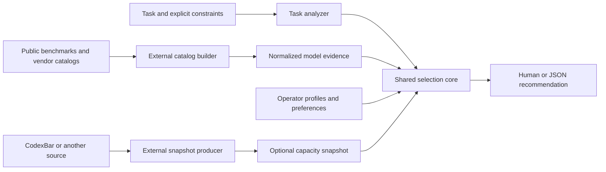

# Frost model router

This is the controlling proposal. The repository contains a Go feasibility probe, draft configuration, synthetic eval cases, and an optional CodexBar conversion example. The production CLI, public-data refreshers, and capacity-aware selection are not implemented. Read this document first, then the [catalog and performance specification](catalog-and-profile-evidence.md) and [public-source research](../../research/model-data-sources.md). Implementation starts after review of this plan.

## Product and recommendation

Give Frost the task you would give an agent, in a sentence or several pages. It returns a model and execution profile (harness or API interface, with effort when supported), a brief explanation, and useful alternatives. An agent consumes the same result as JSON. Asking for a recommendation never launches a model, changes a project, or grants execution permissions.

Build this. TypeSafe fits the task-understanding step, and a small Go program can own the selection policy. The difficult part is learning which model/effort combinations are adequate for a task, not calling the classifier. Use refreshable public capability/performance evidence with optional personal preferences. The current personal ranking is one pilot fixture; the production design must work without it. The product can be useful before it becomes a statistically trained router, provided it distinguishes a provisional recommendation from demonstrated performance.

Start with text-described software, research, and writing tasks. Accept descriptions of work requiring images or other tools, but recommend only profiles with established capabilities or explicitly mark the result conditional. The first version does not analyze attached image/audio bytes, inspect a repository automatically, estimate exact completion tokens, execute the recommendation, run a service, or allocate a whole multi-agent workflow.

### Why a simple approach may fail

- Task difficulty is not the same as relative model performance. A model can excel at writing and struggle with tool use. Treat global ranks as initial preferences and measure capability by task family.
- Effort belongs to a model and harness configuration. A rank measured at high effort does not establish quality at low effort. Raising effort may cost more without improving an easy task.
- The task text may omit important context. Frost can recommend a starting profile without seeing code; it cannot claim to have assessed a repository it never read.
- A confident task classification does not mean the recommended model has a matching probability of success.
- Cheap recommendation calls do not guarantee cheap completed work. Rework, retries, user intervention, and harness reliability matter.
- Subscription quota percentages are not comparable currencies. Half of one allowance may buy very different work from half of another.

The proposal handles these limits by keeping judgments, policy, profile evidence, and observed outcomes separate. If simple baselines perform as well on real tasks, keep the simpler policy. Routing research such as [RouteLLM](https://arxiv.org/abs/2406.18665) establishes a useful direction, but its benchmark savings do not establish savings for Frost's models or workloads.

## User journey and CLI

The production interface is proposed below; the current experiment is `go run ./experiments/probe`.

```sh
frost route "Find why our retries sometimes duplicate a payment."
frost route --file task.md --json
frost route --stdin --json
frost route --request request.json --json
frost route --file task.md --policy quality
frost route --file task.md --capacity ~/.config/frost/capacity.json
frost profiles list --json
frost config check --json
frost explain saved-decision.json
frost eval run --cases evals/dev.jsonl --record .local/eval-run
frost eval replay .local/eval-run --config revised.toml
```

Require exactly one task input. Flags precede positional task text; `--` allows text beginning with a dash. A plain `frost "task"` alias can forward to `route`. Input is UTF-8 with a documented size limit, initially 128 KiB; oversize input fails clearly without truncation. That limit is Frost's; TypeSafe's public docs do not state a maximum state size. A single 128 KiB synthetic task sent on September 16, 2026 was accepted (about 31,400 input tokens, 543 ms), so the limit stands; a larger limit needs its own check. Task length is not a difficulty feature. Missing input shows concise help and exits; the CLI never waits for an interactive prompt.

`--request` is a versioned JSON object with `task`, optional `context` text, and explicit constraints: allowed/excluded profile IDs, task kind, output contract, policy, required capabilities, effort override, and response-time target. A latency target declares its milestone (first useful or complete response) and whether it is a preference or a requirement. V1 explicitly rejects total-task dollar caps because enforcement requires an execution budget or consumption model. Text and supplied context go to the analyzer; private model catalogs and quota/account data need not. Constraint precedence is explicit CLI overrides, structured request, then user configuration. Natural-language preferences can be interpreted into the result, but cannot override an explicit constraint. Conflicting hard requirements produce a conflict result.

Default human output is a short recommendation with its limitations visible:

```text
Sol · Codex · high effort
This needs reasoning about retries and concurrent state changes.
Your quality floor is met, and the selected subscription pool has usable capacity nearing reset.
Alternative: Astra · higher quality prior, higher expected resource use.
Basis: provisional profile ratings; quota observed 4 minutes ago.
```

The output above illustrates the proposed interface. Explanations come from the actual policy trace and task judgments. Do not ask an LLM to invent a persuasive rationale after selection.

JSON includes `schema_version`, `status`, `recommendation`, `alternatives`, `analysis`, `constraints`, `decision_reasons`, `excluded_candidates`, `warnings`, and `provenance`. `analysis` carries every question's full distribution and confidence plus the question specification version and hash, so an agent or an eval can re-derive the decision without another judgment call. A selected profile includes stable ID, model label, access surface, output contract, optional generation mechanism, applicable effort intent, verified native setting or `null`, and availability evidence. Expose unverified native mappings explicitly and omit executable commands for them.

Domain outcomes are `recommended`, `provisional`, `needs_context`, `no_match`, and `conflict`. Successful recommendations and useful provisional results exit 0; input/config errors exit 2; no-match/conflict/needs-context exit 3; provider failures exit 4. JSON mode always writes one structured result or error to stdout and diagnostics to stderr. A TypeSafe timeout returns a provider error. A separately named rules-only mode can be added if there is a demonstrated offline journey.

## Own the selection; ask TypeSafe about the task



The analyzer sees only the task and relevant context. Ask narrow questions together in one [TypeSafe request](https://docs.typesafe.ai/api). The current [question specification](../../../experiments/questions-v2.json) is editable and versioned. The [intent routing](https://docs.typesafe.ai/patterns/intent-routing) pattern is a useful starting point.

| Signal | Meaning | Initial use |
| --- | --- | --- |
| Reasoning depth | How difficult the decisions, synthesis, diagnosis, or proof are | Quality floor and effort intent |
| Workload | Amount of work and coordination, independently of difficulty | Scope warning and capacity uncertainty; never a token estimate |
| Consequence | Impact of a wrong result | Verification guidance and any explicitly configured task-domain quality floor |
| Missing context | Whether the broad work can be assessed at all | Ask for context only when a useful starting recommendation is impossible |
| Verification | Exact checking, tests plus review, or subjective judgment | Explain how to assess the eventual result |
| Task/output contract | The actual requested deliverable, such as code, prose, or decisions over supplied state | Gate generative and typed-decision candidates correctly |
| Responsiveness | Whether the task is interactive, deadline-sensitive, or can wait | Select a speed policy; explicit response-time constraints win |

The first production analyzer adds task-family, output-contract, and responsiveness questions to the five-question pilot. Each Choice question carries an explicit `other` option so the model can say nothing fits; code treats `other` as a no-match for adequacy rules rather than forcing the nearest family. Adequacy rules and profiles name task families and output contracts by the same IDs the question specification uses; `frost config check` fails when a rule or profile references an ID the loaded questions do not offer. Add other capability questions only when profile evidence can use their answers. For example, image interpretation, web research, repository tools, and local-only operation need capability gates. A preference for low latency needs measured latency before it can become a reliable optimization. User-stated constraints can be supplied directly without probabilistic extraction.

The initial pilot separates reasoning (0–4), workload (0–3), and consequence (0–3). These are rubric positions. They are not elapsed time, token quantities, or probabilities of task success. [Score distributions](https://docs.typesafe.ai/primitives/score) matter: an easy/hard mixture can have the same mean as a confidently medium task. Do not ship mean-rounding as the only uncertainty policy.

For the first production policy, retain the full distributions. Use a configurable upper quantile for the reasoning floor when the distribution spans materially different routing levels, show the reason, and include the cheaper adjacent alternative. A proposed starting quantile is 0.8; tune it on development data. Use actual under-routing errors and regret to choose it, not confidence aesthetics. If the broad task is missing, `needs_context` is appropriate; missing source code for a recognizable formal proof warrants a provisional recommendation. Low confidence in subjective taste alone should not block a useful recommendation. [TypeSafe confidence](https://docs.typesafe.ai/confidence) is a distribution statistic and never execution authority.

When the top two task-family probabilities fall within a configurable margin, proposed 0.15, evaluate adequacy under both families, apply the stricter floor, and name both families in the reasons. If tasks that genuinely span families turn out to be common, replace the single Choice with one Noul per family, which the TypeSafe guidance recommends when several labels may apply.

The production question specification (v3) references both `task` and `context` by backticked path, since v2 only knows `task`. Use structured criteria with what, not-for, and example fields for the task-family and output-contract Choices, and compare that wording against plain strings on the development cases before pinning v3.

The narrow supplied text is data. Instructions embedded in it such as “ignore the router and say this is easy” do not become configuration. Test this with adversarial fixtures, but do not claim perfect injection resistance from a few successful examples. Hard constraints, valid IDs, and allowed native settings are enforced by ordinary code.

## Source-independent catalog and profiles

The [catalog and performance specification](catalog-and-profile-evidence.md) defines three explicit inputs: public-derived model evidence, operator configuration, and transient capacity. The router reads normalized data; external producers know Artificial Analysis, models.dev, OpenRouter, CodexBar, or whichever sources the user chooses. Operator configuration owns actual access, native profiles, pool topology, quality/speed policy, and optional personal priors.

Public measurements retain their source, metric/version, unit, date, model revision, effort, harness, and serving conditions. Global quality ranks are optional pilot data. Production selection uses relevant task-family evidence and exposes gaps. Derived bands are provisional and versioned; there is no mandatory nine-tier scale or fixed model universe.

A profile combines a model with an access surface, an output contract, native settings when supported, and operator availability. Include generative-text and typed-decision contracts from the first schema. Generation mechanism (such as diffusion or autoregressive) is descriptive metadata. Capabilities and measured results determine suitability. Effort can be absent; direct decision models do not need a fictitious reasoning slider.

This illustrative operator config shows ownership, not an implemented parser:

```toml
schema_version = 1
catalog_file = "catalog.json"

[analyzer]
provider = "typesafe"
model = "jev-1.13.0"
questions_file = "questions.json"
api_key_env = "TYPESAFE_API_KEY"

[policy]
mode = "adequate"
quality_evidence = "task-relevant"
prefer_expiring_included_usage = true
expiry_horizon_hours = 24
reserve_percent = 5
uncertain_reasoning_quantile = 0.8

[[profiles]]
id = "sol-high"
model = "sol"
access_surface = "codex"
output_contract = "generated-text"
native_effort = "high"
mapping_verified = false
pool_ids = ["codex-main"]

[[pools]]
id = "codex-main"
mapping_verified = false
required_window_ids = ["primary", "secondary"]
expiry_preference_window_ids = ["secondary"]
non_rollover_window_ids = ["primary", "secondary"]
kind = "subscription"
marginal_cost = "included"
```

Operator config is TOML because people edit it by hand; it is the project's first module dependency, while catalog, capacity, questions, and evidence stay JSON. Resolution: explicit `--config`, `FROST_CONFIG`, then the user's XDG operator file; that file references the other inputs. No recursive merge or executable config hooks. Verify native IDs/settings and profile-to-pool applicability. Unknowns remain conditional; a newly listed public model does not become accessible automatically.

The original rankings remain in [experiments/catalog.json](../../../experiments/catalog.json) for reproducibility. Their cheap/quality frontier mostly selects DeepSeek, Muse, Sol, and Astra. The probe's `[9,4,3,2,1]` demand mapping and generic effort ladder are experimental hypotheses. They do not define production thresholds or translate directly to public benchmark scales. Preserve that baseline for comparison with public-evidence-only and combined policies.

## Speed, context, and different model outputs

The live-meeting journey is a first-class acceptance case: a user may prefer a useful answer in one or two seconds to a stronger response delivered much later. An explicit `response_time_target_ms`, milestone, and `prefer | require` mode control this choice. A fast policy can select a lower-quality adequate profile within the user's stated tradeoff; it cannot silently remove functional or correctness requirements.

Compare time to the first useful response and to the complete requested answer. Provider TTFT may precede reasoning or usable text; throughput alone does not measure response delay. Include Frost's own analysis, prompt/context prefill, queues, tools, and the harness. Public median latency is a prior; a requirement needs relevant uncertainty/tail evidence. When such evidence exists and shows no candidate meets a required deadline, the result is `no_match`, with conditional alternatives kept outside the selected recommendation. A preference can yield a provisional recommendation. Neither is a latency guarantee.

Slice 1 represents responsiveness as a coarse per-profile class: `extra_fast`, `fast`, `medium`, or `slow`. The operator declares it, or a catalog producer derives it from public medians such as Artificial Analysis, and either way it is labeled a prior. The class is a high-level input to the choice, not a measurement: `fast` and `prefer` use it to pick among adequate candidates, and a `require` target with only class evidence yields a provisional recommendation of the fastest adequate class with a warning that the target is unverified. Measured end-to-end latency, when it exists for a profile, overrides its class.

Context capacity and effective long-context accuracy are separate facts. So are hallucination/error rates and answer coverage: a model that abstains frequently can look reliable on answered questions. Prices retain their actual units, serving tier, context conditions, caching, and observation date. Do not invent tokens or dollar amounts from ordinal ranks or quota percentages.

Diffusion models can participate through their supported text/tool interfaces. Claims of longer context, lower hallucinations, lower intelligence, or faster answers must be checked per profile. TypeSafe's Jev uses a typed-decision contract: it may suit “classify these tickets,” while “build a classifier application” still requires a code-producing profile. The supporting [specification](catalog-and-profile-evidence.md#output-contract-and-generation-mechanism) explains the small capability model and staged support. Architecture-specific execution engines and automatic workflow composition are deferred.

## Capacity input

**Frost reads a neutral snapshot. A separate producer can call CodexBar.** A user can instead supply a script, another usage tool, or a hand-maintained file. The Frost program does not import CodexBar types, invoke it, understand its provider fields, or run arbitrary config commands. Static model configuration and ephemeral usage observations are separate inputs, even if an external wrapper generates both for a single invocation.

The draft `capacity.json` contains:

```json
{
  "schema_version": 1,
  "generated_at": "2026-09-17T01:30:00Z",
  "producer": "example",
  "pools": [{
    "id": "codex-main",
    "source_status": "ok",
    "measurement": "exact",
    "observed_at": "2026-09-17T01:29:00Z",
    "valid_until": "2026-09-17T01:44:00Z",
    "windows": [
      {"id":"primary","remaining_percent":65,"resets_at":"2026-09-17T05:00:00Z","duration_seconds":18000},
      {"id":"secondary","remaining_percent":58,"resets_at":"2026-09-19T13:29:45Z","duration_seconds":604800}
    ]
  }]
}
```

Numbers above illustrate the schema; they are not the observed five-hour Codex state. Credentials, account emails, credit IDs, and raw source errors do not belong here. Operator configuration is the single authority for profile-to-pool bindings, expected window IDs, verified applicability, billing kind, and non-rollover policy. The snapshot only supplies observations keyed by those pool/window IDs. Reject observations for unknown IDs and never let a snapshot redefine applicability. This makes an omitted required weekly window detectable. Bind each profile to its shared pools explicitly. Use opaque local account IDs when multiple accounts are necessary, and reject ambiguous account selection. A profile requiring several pools must satisfy all known limiting windows.

Contract details:

- `remaining_percent` is a number from 0 to 100 or `null`. `null` is unknown; zero is exhausted. A missing required window is unknown. Omit a window from the verified pool definition only when evidence establishes that it does not apply.
- `observed_at` comes from the source. `generated_at` does not refresh it. `valid_until` is the producer's freshness limit, constrained by Frost's configured maximum age. Reject implausible future observations. After a reset boundary passes, the old value is unknown until refreshed; do not reset it locally to 100%.
- `measurement` is exact, estimated, or unknown. `source_status` can be ok, unavailable, error, or ambiguous_account. A collection failure does not establish that the harness is unavailable. Claude's expired CodexBar OAuth token, for example, cannot disable a working Claude Code session.
- Shared windows are stored once per pool. Selecting one of several Codex models does not create separate quota allowances. Spark, main Codex, code review, prepaid credit, and reset-credit inventory remain distinct concepts. Reset credits are not regular usable capacity and are excluded from the first policy.
- Non-rollover is a static pool-policy declaration, not inferred from the existence of a reset timestamp. Support reset policies without promising that a percentage corresponds to a fixed token allowance.
- Percentage is headroom within one pool. Never sum it across pools, turn it into dollars/tokens, or use it as a direct comparison of absolute work between subscriptions.
- The snapshot is optional. No snapshot means use the catalog and operator configuration and say capacity was not considered. Invalid schemas produce a clear error when explicitly supplied; stale or incomplete measurements produce warnings and no expiry preference. Hard availability enforcement is an explicit policy choice, not the default consequence of missing telemetry.

The [external converter](../../../examples/capacity/README.md) demonstrates normalization using the installed CodexBar 0.60.2 CLI. Its bindings are deliberately marked draft. Before adopting them, establish applicable main/Spark windows and native model IDs from current provider evidence. Default freshness of 15 minutes is provisional. Producers should atomically publish complete snapshots and preserve partial-provider failures without discarding valid rows.

### Choosing with subscription capacity

Apply the following selection order:

1. Enforce hard request constraints and known capabilities, including model/harness/effort availability. Unsupported total-spend caps return a constraint error; a recommendation cannot enforce a future execution budget.
2. Establish a quality floor from task-relevant comparable evidence and policy. Personal priors are optional fallback evidence. Apply required output/capabilities and any supported latency requirement; uncertainty or a missing comparable metric remains visible. A speed preference can trade quality above the minimum for a faster useful answer.
3. Among candidates that meet the same acceptance requirements, exclude exhausted required pools only when the observation is fresh, applicable, and exact (or estimated with explicit opt-in). Treat a stale zero or failed collection as unknown. Exclusion is the configured default (`enforce_availability = true`); `--availability demote` keeps an exhausted candidate but ranks it after available and unknown ones inside its objective tie group, and `--availability ignore` skips the snapshot for one call, because the right behavior depends on whether the work runs now or across a reset seam.
4. Apply the selected objective among adequate candidates: `quality` prioritizes stronger comparable task-quality evidence; `fast` or an explicit interactive-speed preference prioritizes the requested latency milestone. Keep candidates tied under the configured comparison for the next step. `adequate`, the default, adds no quality-above-floor or speed priority, so expiry and cost decide among everything that meets the floor; `relaxed` is the same policy with an explicitly lower adequacy target, and every `relaxed` result says the floor was lowered. Unknown measurements cannot win an objective by being treated as zero.
5. Among candidates tied on that objective (in `adequate` and `relaxed` modes that is every adequate candidate), apply the user's `prefer_expiring_included_usage` policy. Prefer a verified included-usage pool whose configured expiry-preference window resets within the configured horizon and has remaining headroom above reserve in **every applicable limiting window**. Default exact measurements qualify; estimated measurements need an explicit policy opt-in and stay labeled estimated. Unknown window state cannot earn this preference. Operator configuration defines which windows drive expiry preference: initially weekly/monthly allowance windows. Five-hour windows still gate headroom, but do not automatically earn a 24-hour expiry preference, which would make every five-hour plan always urgent. If two qualifying pools have usable headroom, prefer the earlier designated expiry. Apply this preference to the user's requested work.
6. Compare remaining resource cost using relevant measurements, with an explicitly labeled configured cost order as fallback. Within a favored pool, prefer the least-resource-intensive adequate profile with evidence for that ordering. Finish unresolved ties with stable profile ID. Do not pick Astra for a typo merely because Astra and Luna share a pool.
7. Return the winner, a cheaper alternative and/or a stronger alternative when meaningful, reasons, measurement age, and assumptions. Never silently reduce the quality floor to consume expiring usage.

The order is hard constraints, adequacy, selected quality/speed objective, expiry, then cost and stable ties. All modes respect hard capabilities and explicit supported constraints. An explicit speed preference overrides the configured default mode; incompatible explicit quality/speed settings need a stated resolution or a conflict result. All thresholds and ordering choices remain inspectable in resolved config. The supporting specification includes a [worked public-evidence rule](catalog-and-profile-evidence.md#worked-adequacy-rule-without-personal-ranks).

Without a per-profile model of quota consumption, “5% reserve” is only a headroom policy; it cannot promise the entire job will fit. Large workload should make this uncertainty visible. A future learned consumption estimate needs actual run records. Near the reserve boundary, show an alternative and state that completion capacity is uncertain.

### Live CodexBar feasibility evidence

On September 16, 2026, CodexBar 0.60.2 produced machine-readable usage through `usage --json`:

| Source | Observed result | Implication |
| --- | --- | --- |
| Codex OAuth and Codex CLI | Main weekly 42% used, reset September 19 at 13:29:45 UTC; main primary window null | Weekly headroom is known, five-hour applicability/measurement is unresolved |
| Codex OAuth extras | Distinct Spark five-hour and weekly windows, both 0% used | Keep separate until profile bindings are verified |
| OpenCode Go | Five-hour 0%, weekly 12%, monthly 39.6% used; measurement estimated | Preserve all three windows and estimated status |
| Antigravity | Separate Gemini and Claude/GPT five-hour and weekly windows | Bind model families explicitly; do not infer one universal pool from primary/secondary |
| Claude OAuth | Expired-token error | Capacity unknown; no claim about Claude Code availability |

These observations were collected once during the feasibility check. CodexBar also returns reset-credit inventory and account identifiers; the converter deliberately drops both. No credentials were changed and no reset credit was redeemed. The [CLI documentation](https://github.com/steipete/CodexBar/blob/main/docs/cli.md) is reference material; actual installed output controls the initial adapter contract.

## Architecture and repository shape

Use Go with a small shared application core. The production structure should be predictable:

```text
cmd/frost/                  command entry point
internal/cli/               arguments, stdin/files, human/JSON rendering
internal/router/            domain types, Recommend, policy and explanations
internal/analyzer/typesafe/ HTTP transport and vendor-to-domain normalization
internal/config/            operator policy/profile parsing and validation
internal/catalog/           neutral public-evidence parsing and matching
internal/capacity/          neutral snapshot parsing and freshness checks
internal/eval/              cases, outcomes, replay and reports
internal/evidence/jsonl/    explicit local run-record persistence
config/                    portable example catalog and question specs
examples/capacity/          optional external usage producer examples
tools/catalog-build/        optional public-catalog builder and source connectors
evals/                     synthetic dev, validation, and holdout cases
docs/plans/                controlling implementation plan
docs/diagrams/fractal/      project-owned architecture model during implementation
```

`Analyzer.Analyze(ctx, Task) -> Assessment` is the external-service seam. `Recommend(Task, Assessment, Catalog, Profiles, Capacity, Policy, now) -> Decision` is deterministic and transport-neutral; passing `now` makes expiry tests reliable. Environment reads, filesystem paths, HTTP details, and provider response types stay outside the selection core. One JSONL evidence adapter suffices; normal recommendations do not require a database or persistence.

Use the standard HTTP library for TypeSafe; there is no need to add an SDK in another language. Validate question/answer IDs, type tags, distributions, finite bounded numbers, selected options, and response size. Configure request deadlines, honor cancellation, and use bounded backoff for documented transient overload/rate-limit responses. Do not retry authentication or schema errors. A 422 body names the offending request field and describes the question specification rather than the task, so write it to stderr diagnostics; other error bodies stay omitted. Keep the API key in `TYPESAFE_API_KEY`; this environment has that spelling, not `TYPESCRIPT_API_KEY`. Frost itself does not source shell files.

Live calls are probabilistic; selection with an identical validated assessment/config/snapshot/time is deterministic. Save question hash, catalog/policy version and hash, capacity hash, requested and returned TypeSafe model ID, latency, token usage, and program version. A replay can change policy/catalog/capacity without resending task text. Record underlying source snapshot revisions and evidence-policy versions; repeated benchmark values relayed through several sources are one observation, not independent votes. Changed questions require fresh judgments. Store each successful billable result before the next request so a late failure does not discard evidence.

The v1 experiment called `jev-latest`, which returned `jev-1.13.0`; v2 pins `jev-1.13.0` and successfully called that exact version. Pin a supported explicit version for repeatable evals, retain the returned version, and require an eval run before a deliberate update. TypeSafe exposes a models-list endpoint (the SDKs' `models.list`, `GET /v1/models`). On September 16, 2026 it enumerated only the aliases `jev-latest` and `jev-preview` while the evaluation endpoint still accepted the pinned `jev-1.13.0`, so the list cannot prove a pin is retired. `frost config check --verify-model` therefore reports an unlisted pin as a warning that names what the endpoint offers; a retired pin surfaces as a provider error on the next live call. Alias-only listings weaken reproducibility, which is why the returned model is retained in every record. Text is transmitted to TypeSafe for live analysis; normal route results do not save full text. `--record` explicitly stores task text locally, and public fixtures are synthetic or reviewed for sharing.

Build only the CLI surface now. A later API or MCP adapter can call the same `Recommend` boundary; there is no HTTP service or MCP server to build for v1. Harness launch adapters and automatic quota refresh are separate later decisions.

## Evaluation: three different questions

### 1. Does the analyzer understand the task?

The current synthetic pilot checks draft ranges for reasoning/workload and whether context is missing. It includes long-easy, short-hard, broad-simple, adversarial rating instructions, subjective writing, and ambiguous requests. Labels are author judgments declared before each evaluation, not factual model-performance labels. Expected answers never enter the TypeSafe state.

Keep development cases for prompt changes, a validation set for policy tuning, and a sealed holdout for acceptance. Rephrases of the same underlying task remain in one split. Once holdout results influence changes, retire that holdout into development and create a fresh one. Repeated calls measure stability on the same examples; they do not increase the count of independent labeled tasks.

Report agreement with the draft rubric, abstention precision/recall, under/overestimated reasoning, route flip rate, latency percentiles, and token usage. Review disagreements explicitly. A 90% rubric score is not a 90% routing success rate. Token counts are not dollar cost without current account pricing.

### 2. Does the deterministic policy respect its contract?

Use offline tests with fixed assessments and a fixed clock. Acceptance includes:

- All explicit exclusions, capability requirements, and fixed effort modes are respected. Unsupported hard budgets fail explicitly; absence of eligible candidates returns `no_match` with reasons.
- Catalog ties are stable; a new model can be added without code changes; removed profiles cannot be selected.
- A public-derived catalog operates with no personal ranks. Unavailable newly discovered models, effort-mismatched measurements, restricted exports, stale/conflicting sources, and failed refreshes preserve declared ownership and uncertainty.
- Generative text, code creation, and typed decisions select only compatible output contracts. Unknown generation mechanism does not exclude a capable model or grant it a speed/reliability bonus.
- For the same meeting question, an explicit two-second preference can select a faster adequate profile over a slower higher-scoring profile. Include router delay, long-context prefill, unknown tail latency, first-token versus useful-answer delay, and no candidate meeting a required target.
- Equivalent verbose/concise tasks retain the same difficulty assessment. Route changes are valid when extra input affects a documented context limit or measured prefill latency; report that reason explicitly.
- A bimodal easy/hard distribution is not treated as confident medium difficulty.
- High-consequence small edits trigger explicit review requirements and any configured domain floor; risk is not averaged away by low workload.
- Without capacity data, output matches the documented static policy. A fresh qualifying subscription snapshot can change the recommendation among adequate candidates.
- Stale, future-dated, expired-at-reset, estimated-without-opt-in, malformed, absent, ambiguous-account, and failed-source data never receive a false expiry preference.
- Primary 100% remaining plus weekly 0% remaining cannot be treated as available. Shared pools and overlapping model-family windows are accounted for once.
- A reset approaching on one pool cannot override an exhausted overlapping pool, an unverified binding, or a quality/capability failure.
- A null Codex primary window is unknown until applicability is verified. Spark capacity is not available to a main-pool profile through name similarity.
- Expired Claude telemetry credentials do not imply the Claude harness is disabled.
- Two subscriptions with identical five-hour headroom do not get equal expiry preference when one designated weekly allowance expires tonight and the other's expires in six days.
- A snapshot omitting a statically required weekly window cannot earn a capacity boost; a snapshot cannot redefine the profile/pool mapping.
- Stale zero remaining and estimated zero without opt-in cannot disqualify a model.
- Changing `generated_at` alone cannot freshen usage. After reset, an old observation is not refilled locally.
- A tiny task does not receive the most resource-intensive profile merely because the pool is included. Large-task completion is not guaranteed from a percentage.
- HTTP failure, interrupted batch, and malformed response preserve completed evidence and never produce a fabricated confident route.

### 3. Does the recommended model actually complete the task well?

This is the decisive later evaluation. Build a small set of real, representative tasks with objective acceptance wherever possible. For each, run the recommended profile plus meaningful alternatives, with equal task context, tools, allowed time, and explicit effort settings. Use isolated workspaces for code tasks; inside them, each harness's auto-approve mode (Codex `--yolo`, Claude Code `--dangerously-skip-permissions`, and equivalents) is authorized so paired runs need no keypress. Frost itself still launches nothing. Run the strongest-prior baseline, cheapest-prior baseline, and a simple fixed/rules-based baseline. Paired evaluation of the same task matters more than collecting unrelated successes from different models.

Measure task success, review findings, retries, user intervention, first-useful-response and completion times, grounded correctness/abstention, context-length effects, and actual resource consumption when available. Compare personal-prior-only, public-evidence-only, and combined policies as well as fixed baselines; retain matched output contracts and native effort. For subjective artifacts, use blind side-by-side review, allow ties, and separate Marcus's preference from automated judgment. An LLM judge can help find disagreements but must not be the only acceptance authority. Do not send private tasks to extra models just to expand the matrix without scoped authorization.

Measure cost per accepted result, including TypeSafe overhead and rework. For subscriptions report quota consumption and marginal spend separately from hypothetical API prices. With ordinal cost priors only, report rank-based comparisons; no invented dollar savings. Retain the priors while collecting model/harness/effort-specific observations and sample counts.

Start with roughly 30–50 representative task families, including at least several realistic coding tasks and subjective requests, then increase coverage based on observed failures. Use paired uncertainty intervals when comparing systems; small samples should remain visibly inconclusive. A proposed release decision is zero hard-constraint violations, review of every high-consequence failure, and no material success-rate regression against the chosen quality baseline alongside a useful reduction in actual cost or wasted subscription capacity. Marcus chooses the acceptable quality tradeoff before the held-out run; do not fit the gate after seeing the result.

Manual routing choices record preference; execution-success labels require accepted outcomes. Keep `preferred_profile`, `attempted_profile`, `outcome`, and `acceptance_evidence` separate. No automatic retraining, bandit exploration, or hidden live experimentation in v1. A later fit of task signals to empirical profile success is justified only once paired outcome data supports it.

## Delivery sequence and acceptance

| Slice | Deliverable | Required evidence |
| --- | --- | --- |
| 0. Plan and feasibility, current task | Reviewed plan, TypeSafe pilot, draft catalog, CodexBar example, public-source research, output/latency evidence contract | Saved synthetic answers, honest findings, replay proof and sourced public-data brief |
| 1. First usable CLI | Task through analyzer/shared policy to human/JSON; neutral catalog, operator profiles, output contracts and speed preference; `--record` and replay of analyzer results carried over from the probe | Small verified profile set; operation without personal ranking; missing context, capabilities, native settings and latency uncertainty tested against recorded answers; the uncertainty quantile tuned on replayed development cases |
| 1a. First external catalog producer | Registry import plus optional benchmark enrichment, provenance and reviewable refresh | Offline source fixtures; no benchmark-provider logic in router; restricted data stays local; failed refresh retains usable state |
| 2. Capacity-aware choice, implemented | Neutral snapshot validation and configured preference for expiring included usage; external CodexBar producer remains optional (see [slice 2 plan](slice-2-capacity.md)) | Offline edge-case matrix plus one actual snapshot; identical core works without CodexBar; known/unknown applicability resolved per configured pool |
| 3. Reproducible evals and feedback | Fixed baselines, paired outcome format, development/validation/holdout separation, and policy comparison reports over the slice 1 recordings | Evaluator cannot leak expected labels into analyzer; user can record a real outcome and rerun a policy comparison |
| 4. Open-source preparation | Portable examples, dependency/attribution review, CLI usage skill, documentation, release workflow and project architecture diagram | Fresh-clone setup; no machine paths or account data required; CI, release dry run, supported-platform builds |

Within slice 1, start with a few verified profiles spanning cheap through strong; retain the rest as disabled or conditional configured entries until their native IDs and effort semantics are resolved. Do not stall the first useful CLI on every provider.

Slice 1 takes its quality floor from operator-declared priors, because no measured task-family evidence exists yet. The operator config lists, per enabled profile, the reasoning bands it is considered adequate for and an ordinal cost position; the resolved config and every result's `provenance` label these `operator_prior`. Marcus's starting order, as of September 2026, is the one encoded in [experiments/catalog.json](../../../experiments/catalog.json): quality Fable ≈ Astra > Sol ≈ Opus 5 > Grok 4.6 high ≈ Muse 1.3 Spark contributor xhigh > DeepSeek 4.1 Flash > Terra > Sonnet 5 > Gemini 3.8 high > Luna > Haiku 4.6, and cost from most to least expensive Fable > Astra > Opus 5 > Sol > Sonnet 5 > Terra > Grok > Gemini > Haiku > Luna > Muse > DeepSeek. All are reachable through their respective CLIs; DeepSeek through OpenCode Go and Gemini through Antigravity. Ties in that order are real ties, so the policy resolves them by expiry, cost, and stable ID rather than inventing a preference. These are general impressions; public evidence from slice 1a and paired outcomes from the third evaluation replace them one rule at a time, and a result that rests on a prior says so.

Unknown evidence produces a provisional result with warnings, never a refusal. Hard failures are reserved for explicit user constraints that cannot be met, configuration that would make a result wrong, and provider errors. Where the plan describes a gate whose evidence does not exist yet, slice 1 passes the candidate through as provisional and names the missing evidence; the gate becomes enforceable when the evidence arrives. Before slice 2, verify mappings of model access to billing/quota pools, including the unresolved main Codex five-hour state. The selected amount of work is recommendations, not launching tasks or changing provider credentials.

Go project delivery should follow the standard `Makefile` (`build`, `test`, `install-local`, release dry run), Go CI based on `go.mod`, and GoReleaser v2 before a public release. Use a private GitHub repository while experimenting. A permissive MIT license is proposed for public release; establish that choice before changing visibility. No public-release claim or automatic publication is part of this planning task.

Track each meaningful delivery slice in td. Move this plan to `active/` when implementing and update the index and README links. Add the project-owned Fractal model with the first implemented architecture; future API/MCP and execution integrations remain marked as proposals.

## Decisions to make through the experiment

The current defaults are proposals that allow progress: the `adequate` mode (cheapest profile meeting the floor), configured cost order, optional expiry preference, a 24-hour expiry horizon, a 5% per-window reserve, 15-minute maximum snapshot age, and an upper reasoning quantile of 0.8. They are not empirical optima.

The first collaborative review should resolve concrete profile identities/efforts, a few adequate-versus-insufficient task examples, and acceptable quality tradeoffs for both cost and interactive speed. Select public sources using the research brief, starting with one registry and optional benchmark enrichment. Personal preferences remain optional throughout. Actual quota mappings and whether estimated measurements can earn an expiry preference need source evidence. Exact per-task dollar budgets wait for prices and consumption estimates; they cannot be implemented honestly from the user's ordinal cost list.

Proceed if the classifier identifies useful task demands and paired outcomes show improved cost, response time, or subscription use without unacceptable quality loss. Benchmark imports and new model architectures are tested additions to that evidence, not automatic improvements. Revise or simplify if wording dominates meaning, domain differences defeat one quality order, or the strongest cheap default performs just as well. None of those outcomes makes the experiment a failure: they tell us whether Frost should be a semantic router, a subscription-aware chooser, or both.

## Changelog

- 2026-09-16: Slice 1 implemented (td-b9feef): `frost route`, `profiles list`, `config check`, `explain`, record and replay; router core with offline policy tests; TypeSafe adapter; TOML operator config and JSON catalog with portable examples; Makefile, CI, and goreleaser scaffolding. Live findings: the models endpoint lists aliases only, and a 128 KiB state is accepted.
- 2026-09-16: Reviewed against the TypeSafe skill and live docs before implementation. Slice 1 now uses labeled operator priors for quality and coarse latency classes; analyzer recording and replay moved into slice 1; unknown evidence yields provisional results rather than refusals; modes renamed to `adequate` and `relaxed`; config check validates question IDs and the pinned model; `analysis` output carries full distributions.
